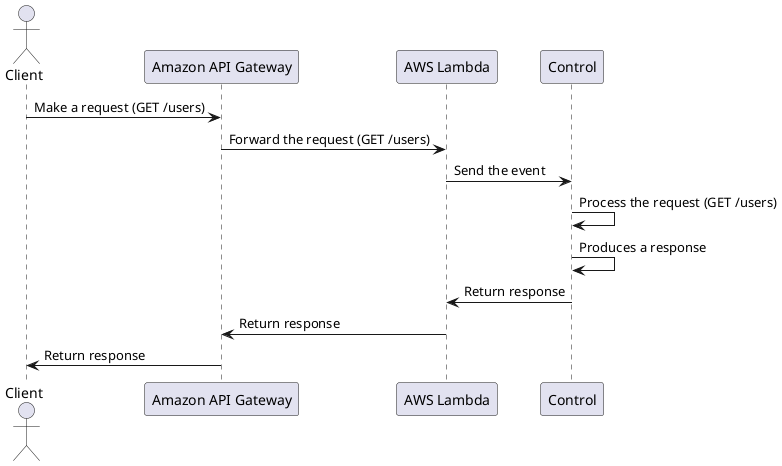

# Control
## Description
Control is a library that implements a simple dispatcher for AWS Lambda Proxy Integration that works with the Java Runtime.

It is inspired by the [PHP Slim Framework definition](https://www.slimframework.com/docs/v4/#whats-the-point).

> **Warning:** Currently it works only with the [Amazon API Gateway HTTP](https://docs.aws.amazon.com/apigateway/latest/developerguide/http-api-develop-integrations-lambda.html).

## How it works
PlantUML code:


## How to install
Paste it in your `pom.xml`:
```xml
<dependency>
    <groupId>com.alvarengacarlos</groupId>
    <artifactId>control</artifactId>
    <version>1.0.0</version>
</dependency>
```

## How to use
Follow the steps below in your `Handler.java` class.

Import the `App` and `ResponseBuilder` classes:
```java
import com.alvarengacarlos.control.App;
import com.alvarengacarlos.control.ResponseBuilder;
```

Create a private class attribute:
```bash
private final App app;
```

Initialize the `App` and create some routes:
```java
public Handler() {
    app = new App();
    Map<String, String> defaultHeaders = Map.of(
        "Content-Type",
        "text/plain"
    );
    app.get("/hello", request ->
        //Some logic...
        new ResponseBuilder()
            .withHeaders(defaultHeaders)
            .withStatusCode(200)
            .withBody("Hello, World!")
            .build()
    );
}
```

> **Tip:** POST, GET, PATCH, PUT and DELETE http methods are supported.

Finally, add the dispatch:
```java
public APIGatewayProxyResponseEvent handleRequest(
    final APIGatewayProxyRequestEvent apiGatewayProxyRequestEvent,
    final Context context
) {
    return app.dispatch(apiGatewayProxyRequestEvent);
}
```

To help you to understand the library, there is an [example](example/README.md).
