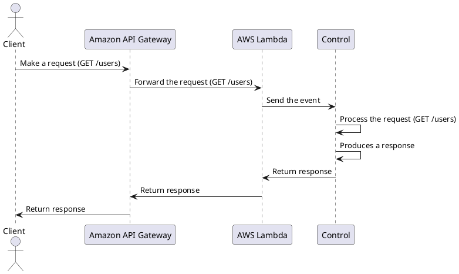

# Control
## Description
Control is a library that implements a simple dispatcher for AWS Lambda Proxy Integration that works with the Java Runtime.

It is inspired by the [PHP Slim Framework definition](https://www.slimframework.com/docs/v4/#whats-the-point).

> **Warning:** Currently it works only with the [Amazon API Gateway HTTP](https://docs.aws.amazon.com/apigateway/latest/developerguide/http-api-develop-integrations-lambda.html).

## How it works
PlantUML code:


## How to install
Paste it in your `pom.xml`:
```xml
```
<!-- TODO: Paste the dependency -->

## How to use
<!-- TODO: Paste a code example -->

## Example
> **Warning:** The following requirements are necessary to proceed:
> - AWS Account
> - SAM CLI
> - Java 21
> - Maven 3.9.9

<!-- TODO: Create a SAM example -->


## Tests
> **Warning:** The following requirements are necessary to proceed:
> - Java 21
> - Maven 3.9.9

### Unit
Run this command:
```bash
mvn surefire:test
# or
mvn test
```

### Integration
Run this command:
```bash
```
<!-- TODO: Paste the command -->
